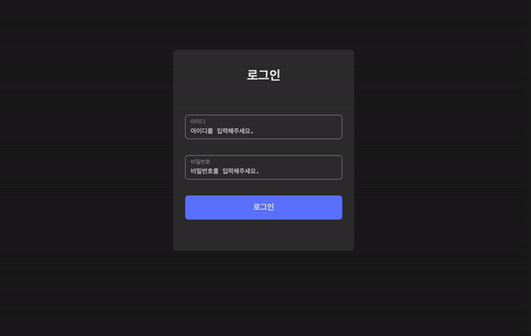
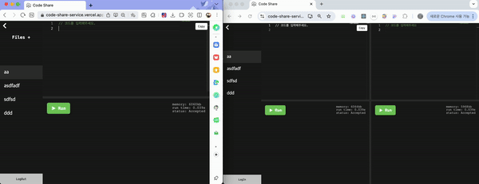
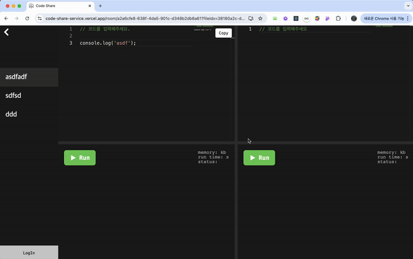
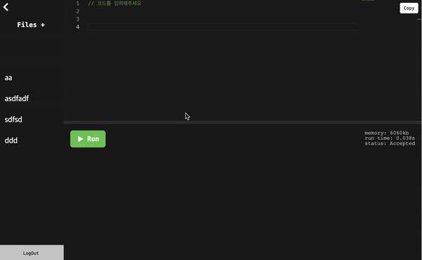
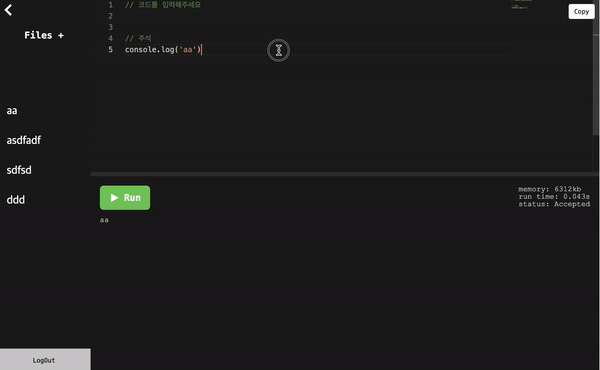
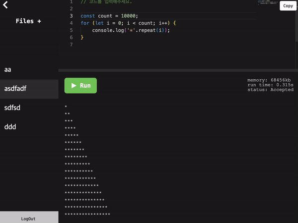
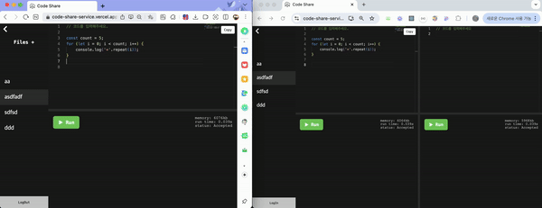
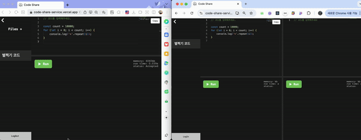
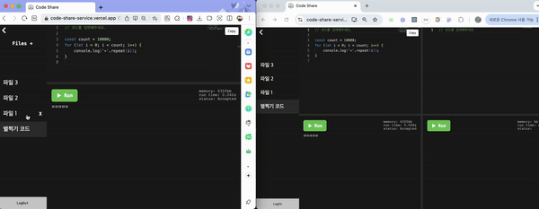
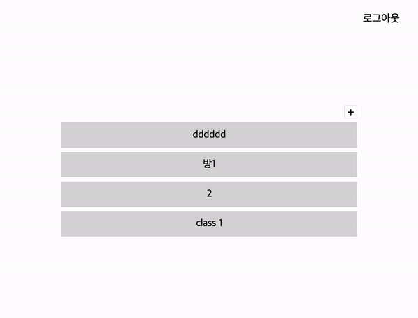

# Internet Programming

# < Code-Share >
### real-time 코드 공유 서비스


## 웹개발팀 소개

|                     안지유                      |                   오현의                    |
|:--------------------------------------------:|:----------------------------------------:|
| [@zzzzzuuuuu](https://github.com/zzzzzuuuuu) | [@hyunyeee](https://github.com/hyunyeee) |

## 시작가이드

### Installation

```bash
$ git clone https://github.com/hyunyeee/code-share-fe.git
$ cd code-share-fe
$ yarn install
$ yarn start
```

<aside>
🔑 교수자 로그인 계정

- `id`: admin
- `pwd`: 1234

</aside>

---

## Stacks 🪡

### Environment


### Config


### Development


### Code Linting and Formatting Tools


### Communication


---

## 주요 기능 📺

### 로그인 유효성 검사
<table>
    <td></td>
</table>

<br />

### 실시간 코드 공유 기능

<table>
    <tr>
      <td><p>Socket 실시간 코드 공유</p></td>
    </tr>
    <tr>
      <td><p>화면 resizing 기능</p></td>
    </tr>
</table>

<br />

### 코드 실행 기능

<table>
    <tr>
      <td><p>정상 실행</p></td>
      <td><p>에러 실행</p></td>
    </tr>
    <tr>
      <td><p>버튼 로딩중 플래그 처리</p></td>
			<td><p>코드 복사 기능</p></td>
    </tr>
</table>

<br />

### File, Room 기능

<table>
	<tr>
	  <td><p>파일 생성 기능</p></td>
	</tr>
	<tr>
	  <td><p>파일 삭제 기능</p></td>
	</tr>
	<tr>
	  <td><p>Room 생성 및 참여 기능</p></td>
	</tr>
</table>


---

## Convention 🚥

### Branch Naming Convention 🪵

| 머릿말     | 설명                   |
|---------|----------------------|
| main    | 서비스 브랜치              |
| develop | 배포 전 작업 기준           |
| feature | 기능 단위 구현             |
| hotfix  | 서비스 중 긴급 수정 건에 대한 처리 |

### Commit Convention ✅

| 머릿말      | 설명                      |
|----------|-------------------------|
| feat     | 기능 구현, 추가               |
| fix      | 버그 수정, 예외 케이스 대응, 기능 개선 |
| setting  | 패키지 설치 및 개발 설정          |
| refactor | 코드 리팩터링                 |
| design   | UI 수정                   |
| style    | 코드 스타일 수정               |
| rename   | 파일명 수정                  |
| test     | 테스트 코드 추가               |
| docs     | 문서 작성 및 변경              |

---

## 폴더 구조

```
.
📝 App.js, index.js, ...
│
📂 src
│
├── 📂 api
│   ├── Axios.js
│   ├── CreateRoom.js
│   ├── GetRooms.js
│   ├── LoginApi.js
│   ├── getFiles.js
│   └── postCode.js
│
├── 📂 assets
│   ├── 📂 docs
│   ├── eye_close.svg
│   ├── eye_open.svg
│   ├── goBack.svg
│   └── run.svg
│
├── 📂 components
│   ├── 📂 codeEditer
│   │   ├── CodeEditor.js
│   │   ├── CopyBtn.js
│   │   ├── FileList.js
│   │   └── ResultContainer.js
│   ├── 📂 login
│   │   ├── HiddenBtn.js
│   │   ├── Input.js
│   │   └── LogInForm.js
│   └── 📂 room
│       ├── CreateRoomModal.js
│       └── NotRoom.js
│
├── 📂 hooks
│   └── useLogout.js
│
├── 📂 pages
│   ├── LogIn.js
│   ├── Main.js
│   └── RoomList.js
├── 📂 styles
│   ├── GlobalStyle.js
│   └── Theme.js
└── 📂 validation
    ├── messages.js
    └── schema.js
```
